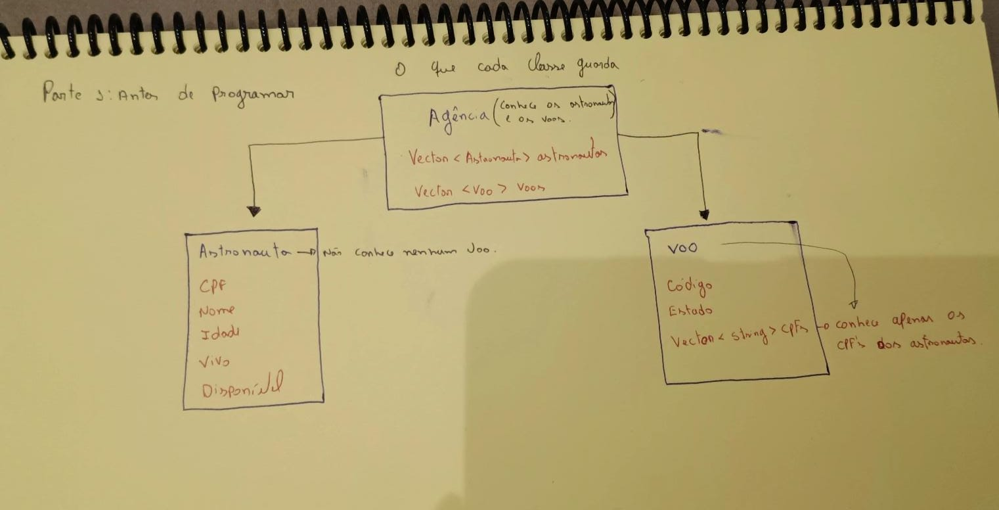

# Diário da atividade

Escreva com as suas palavras. Frases curtas bastam. Não cole a conversa inteira
com a IA. Cole só os pedidos que você enviou.

## Ambiente

- Versão do OpenCode (`opencode --version`): 1.18.31
- Modelo usado: Big Pickle (Free).

## Parte 1: antes de programar

- O que cada classe guarda: 
- O que acontece em `LANCAR_VOO`, em palavras: A Agencia procura o voo 10 e verifica se está planejado e se tem astronautas. Depois, verifica todos os astronautas: primeiro vivo, depois disponível. Se algum estiver morto ou indisponível, dá erro e para, sem embarcar ninguém. Morto vem primeiro porque um morto também está indisponível. Só depois de todos passarem na verificação, a Agencia manda todos embarcarem e muda o voo para em curso.
- Uma dúvida que eu tinha antes de começar: Fiquei bastante tempo para escrever os laços, tenho muita dificuldade nisso.

## Parte 1: uso de IA para entender algo

- O que perguntei (ou "não usei"): Tive dúvidas sobre como fazer o commit e enviar as alterações do projeto para o GitHub.
- O que aprendi: Aprendi a usar commit e push para enviar as alterações do VS Code para o GitHub.

## Primeiro contato: revisão sem editar

- As três melhorias que a IA sugeriu, em uma linha cada: usar const nos métodos que apenas fazem leitura; usar enum para representar os estados dos voos; reduzir a repetição de código no método listarVoos.
- A que escolhi e por quê: escolhi usar const nos métodos de leitura porque foi uma alteração simples de entender e não mudaria a lógica do programa.
- O que mudou no código, e se os seis testes continuaram passando:foram adicionados const aos 10 métodos de leitura das classes Astronauta e Voo. Os seis testes continuaram passando.
- O que entendi que não sabia antes:entendi que colocar const depois dos parâmetros de um método indica que aquele método não deve modificar os dados do objeto.

## Missão 1: LISTAR_ASTRONAUTAS e HISTORICO

- Primeira mensagem (o pedido do plano): pedi ao OpenCode para implementar os comandos LISTAR_ASTRONAUTAS e HISTORICO cpf, sem alterar os comandos existentes, e pedi que primeiro apresentasse o plano sem editar os arquivos.
- O plano que a IA apresentou, resumido: riar os métodos listarAstronautas() e historico(string cpf) na classe Agencia e adicionar os dois comandos no main().
- Mudei algo no plano antes de liberar? Não. O plano estava de acordo com o que a missão pedia, então autorizei a implementação.
- Resultado de `testar.sh missao1` e de `testar.sh parte1`: 2 de 2 testes passaram na Missão 1 e 6 de 6 testes passaram na Parte 1.
- Precisei refazer? O que mudou no pedido:Não precisei refazer. O primeiro pedido funcionou e os testes passaram.

## Missão 2: SALVAR e CARREGAR

- Primeira mensagem: pedi ao OpenCode para implementar os comandos SALVAR nome_do_arquivo e CARREGAR nome_do_arquivo, salvando e reconstruindo todos os dados dos astronautas e dos voos. Também pedi que primeiro apresentasse o plano sem editar os arquivos.
- O plano, resumido: a IA propôs adicionar <fstream>, criar construtores para reconstruir astronautas e voos com seus estados salvos, criar os métodos salvarDados() e carregarDados() na classe Agencia e adicionar os comandos no main(). Para o carregamento, seriam usados vetores temporários para manter os dados atuais caso houvesse erro.
- O formato do arquivo (cole cinco linhas do `dados_teste.txt`): astronautas 3 111 Ana Maria 30
- Resultado de `testar.sh missao2` e de `testar.sh parte1`: 3 de 3 testes passaram na Missão 2 e 6 de 6 testes passaram na Parte 1.
- Precisei refazer? O que mudou no pedido: Sim. Na primeira tentativa, o formato salvo não era compatível com a forma como o programa fazia a leitura. O marcador e a quantidade foram gravados juntos como astronautas:3, mas o carregamento esperava essas informações separadas. O teste de carregamento falhou. A IA corrigiu o formato para gravar astronautas e a quantidade em linhas separadas. Depois da correção, todos os testes passaram.

## Missão 3: RELATORIO

- Primeira mensagem:
- O plano, resumido:
- Resultado de `testar.sh missao3` e de `testar.sh parte1`:
- Precisei refazer? O que mudou no pedido:

## Missão 4: livre

- O que escolhi e por quê:
- O comando novo, a saída que eu esperava e o nome do meu arquivo de comandos
  (escritos antes de pedir):
- Primeira mensagem:
- O que veio, comparado com o que eu esperava:
- `testar.sh parte1` continuou passando?
- Aceitei, ajustei ou descartei? Por quê:

## Fechamento

- O que a IA fez que eu não conseguiria fazer sozinho nesse prazo:
- Onde ela errou ou fez algo que eu não pedi:
- O que eu faria diferente da próxima vez:
